# 📋 Documento de Escopo — Sistema Jurídico

> **Projeto:** Sistema de Gestão para Escritório de Advocacia
> **Referência:** Padrão AdvBox (advbox.com.br)
> **Versão:** 1.1 — Escopo Alinhado ao Padrão AdvBox
> **Data:** 2026-02-12

---

## 1. Visão Geral

O **Sistema Jurídico** é uma plataforma web completa para gestão inteligente de escritórios de advocacia, inspirada no padrão AdvBox. O sistema conecta todas as áreas do escritório em um único ecossistema: controle de clientes (CRM jurídico), processos judiciais e extrajudiciais, prazos e intimações, tarefas com sistema de pontuação de produtividade (Taskscore), atendimentos automatizados, gestão financeira integrada, editor de documentos jurídicos, controladoria jurídica digital e Business Intelligence com métricas data-driven. O objetivo é transformar escritórios tradicionais em operações inteligentes, conectadas e orientadas por dados — mais clientes atendidos com a mesma equipe, mais tempo para estratégia e menos burocracia.

---

## 2. Personas / Usuários

| Persona | Papel | Necessidades Principais |
|---------|-------|------------------------|
| **Sócio / Titular** | Gestão estratégica | Dashboard BI, métricas de safra e qualidade, relatórios financeiros, KPIs de equipe |
| **Advogado Responsável** | Operação jurídica | Processos atribuídos, intimações distribuídas, tarefas, pauta de audiências |
| **Advogado Associado** | Execução de tarefas | Kanban de tarefas, prazos, pontuação Taskscore, workflow automático |
| **Estagiário / Assistente** | Apoio operacional | Tarefas delegadas, pesquisas, upload de documentos, acompanhamento de prazos |
| **Controlador Jurídico** | Controladoria | Painel de controladoria, processos estagnados, estoque processual, contingenciamento |
| **Secretária / Recepção** | Atendimento e CRM | Cadastro de clientes, pipeline de atendimento, agendamento, aniversariantes |
| **Financeiro** | Gestão financeira | Cobranças, inadimplência, fluxo de caixa, DRE/DFC, centros de custo |
| **Administrador** | Configuração | Permissões, integrações, backup, configurações gerais, logs |

---

## 3. Módulos do Sistema

> Estrutura baseada no ecossistema AdvBox, adaptada para desenvolvimento próprio.

---

### 3.1 � Dashboard & BI (Business Intelligence)

| Funcionalidade | Descrição |
|----------------|-----------|
| **Dashboard Executivo** | Visão consolidada com KPIs em tempo real |
| **Métricas Data-Driven** | Indicadores de gestão orientados por dados |
| **Métricas de Safra** | Análise de processos agrupados por ano de entrada (safra) |
| **Métricas de Qualidade** | Taxa de processos ganhos vs perdidos por tipo de ação |
| **Métricas de Honorários** | Receita e custo por tipo de ação |
| **Rentabilidade por Ação** | Cálculo automático de rentabilidade por grupo e tipo de ação |
| **Tempo de Demora** | Cálculo do tempo médio de duração do processo (parcial e total) |
| **Modo Escuro** | Tema dark para o sistema inteiro |

**KPIs do Dashboard:**
- Processos ativos / encerrados no período
- Receita bruta / líquida do mês
- Prazos vencendo nos próximos 7 dias
- Taxa de inadimplência (%)
- Tarefas atrasadas / pendentes
- Novos clientes e processos no mês
- Pontuação Taskscore da equipe
- Processos parados há mais de 120 dias

---

### 3.2 👥 CRM Jurídico (Gestão de Clientes)

| Funcionalidade | Descrição |
|----------------|-----------|
| **Cadastro PF/PJ** | Pessoa Física e Jurídica com dados completos, CPF/CNPJ com validação |
| **Cadastro automatizado por CPF** | Preenchimento automático via consulta de CPF |
| **Controle de Origem** | De onde o cliente veio (indicação, internet, parceiro, etc.) |
| **Pipeline de Prospecção** | Funil de atendimento: Lead → Contato → Consulta → Contrato → Cliente |
| **Aniversariantes** | Notificações de aniversariantes do dia e mês |
| **Partes Contrárias** | Cadastro de partes adversas vinculadas aos processos |
| **Relatórios de Clientes** | Filtros por data, cidade, origem |
| **Análise de Carteira** | Análise inteligente da carteira de clientes |
| **Classificação** | Status: Ativo / Inativo / Prospecto / Arquivado |

---

### 3.3 ⚖️ Gestão de Processos

| Funcionalidade | Descrição |
|----------------|-----------|
| **Processos Judiciais** | Número CNJ, tribunal, vara, comarca, tipo de ação, fase processual, valor da causa, advogado responsável |
| **Processos Administrativos** | Processos em órgãos administrativos |
| **Processos Consultivos** | Consultorias e pareceres jurídicos |
| **Processos de Serviço** | Serviços avulsos (contratos, mediações) |
| **Processos de Prospecção** | Casos em fase de avaliação |
| **Fases Processuais** | Controle de processos por fase com Kanban visual |
| **Sequenciamento de Etapas** | Etapas personalizáveis por tipo de processo |
| **Movimentações / Andamentos** | Timeline de eventos com captura de andamentos |
| **Vinculação de Partes** | Clientes, partes adversas e terceiros vinculados |
| **Documentos** | Upload, versionamento, categorização |
| **Contingenciamento** | Contingenciamento processual (provisão de risco financeiro) |
| **Processos Estagnados** | Controle de processos parados há mais de 120 dias |
| **Estoque Processual** | Controle completo do volume de processos ativos |
| **Processos Ganhos/Perdidos** | Registro de resultado final do processo |
| **Recontratações** | Controle de clientes que retornaram com novos casos |
| **Histórico de Tarefas** | Tarefas pendentes e finalizadas por processo |
| **Financeiro por Processo** | Controle financeiro individual por processo |

**Status do Processo:**

```
Prospecção → Consultoria → Ajuizado → Em Andamento → Audiência → Sentença → Recurso → Trânsito em Julgado → Execução → Encerrado (Ganho/Perdido) → Arquivado
```

---

### 3.4 📅 Prazos, Intimações e Agenda

| Funcionalidade | Descrição |
|----------------|-----------|
| **Prazos Processuais** | Data fatal, contagem em dias úteis/corridos, prazo de cortesia |
| **Intimações Judiciais** | Monitoramento e captura de intimações |
| **Distribuição Automática** | Intimações distribuídas automaticamente ao advogado responsável |
| **Publicações de Diários** | Monitoramento de publicações de Diários de Justiça |
| **Pauta de Audiências** | Pauta automática de audiências por advogado |
| **Compromissos** | Reuniões, consultas, visitas |
| **Notificações** | Alertas por e-mail em D-5, D-3, D-1 e D-0 |
| **Agenda Integrada** | Integração com Google Calendar, Apple Calendar e Outlook |
| **Calendário Unificado** | Visão semanal/mensal por advogado ou geral |

**Regras de Prazo:**

- Contagem padrão em dias úteis (excluindo sábados, domingos e feriados)
- Prazo de cortesia = prazo real − 2 dias úteis
- Prazo não pode ser criado no passado
- Prazos vencidos sem conclusão geram alerta crítico
- Intimações interpretadas geram prazos e tarefas automaticamente

---

### 3.5 ✅ Tarefas e Produtividade (Taskscore)

> Sistema inspirado no método **Taskscore®** da AdvBox — pontuação de produtividade baseada em tarefas cumpridas.

| Funcionalidade | Descrição |
|----------------|-----------|
| **Tarefas com Pontuação** | Cada tarefa tem peso/pontos. Produtividade = soma de pontos das tarefas concluídas |
| **Kanban de Tarefas** | Quadro visual: A Fazer → Em Andamento → Revisão → Concluído |
| **Painel em Tempo Real** | Controle de tarefas em tempo real para gestores |
| **Workflow Automático** | Sequência de tarefas que se criam automaticamente ao mudar fase do processo |
| **Workflow por Etapa** | Cada etapa processual pode disparar tarefas automaticamente |
| **Tarefa para Múltiplos** | Atribuição de uma tarefa a múltiplos usuários |
| **Delegação** | Atribuir/reatribuir tarefas entre membros da equipe |
| **Checklists** | Subtarefas dentro de uma tarefa principal |
| **Comentários** | Comunicação interna dentro da tarefa |
| **Criação de Times** | Agrupamento de advogados em equipes/times |
| **IA - Próxima Tarefa** | Sugestão automática da próxima tarefa com base no histórico |
| **Tarefas D-1, D-0, Fora** | Controle de tarefas cumpridas antes, no dia ou após o prazo |
| **Prioridade** | Urgente / Alta / Normal / Baixa com destaque visual |
| **Tempo Gasto** | Registro de horas trabalhadas por tarefa (timesheet) |

**Métricas de Produtividade:**

- Pontuação Taskscore individual e por time
- Tarefas cumpridas em D-1, D-0 e fora do prazo
- Atividades dos colaboradores (log de ação)
- Tarefas pendentes por colaborador
- Livro de ponto online
- Controle de produtividade pessoal (básico e avançado)

---

### 3.6 🤝 Atendimentos e Automações

| Funcionalidade | Descrição |
|----------------|-----------|
| **Registro de Atendimento** | Contatos: presencial, telefone, e-mail, WhatsApp |
| **Pipeline de Atendimento** | Funil automatizado: Lead → Qualificação → Proposta → Fechamento |
| **Automações de Atendimento** | Envio automático de e-mail, SMS e WhatsApp ao cliente |
| **Triagem** | Classificação: viável / inviável / requer análise |
| **Follow-up Automático** | Agendamento de retorno e lembretes automáticos |
| **Histórico** | Timeline completa de interações com o cliente |
| **Novos Contratos** | Controle de fechamento de contratos |
| **Novos Processos Ajuizados** | Relatório de processos ajuizados no período |
| **Satisfação** | Registro de feedback do cliente |

---

### 3.7 💰 Gestão Financeira

| Funcionalidade | Descrição |
|----------------|-----------|
| **Honorários** | Contrato de honorários: fixo, percentual (êxito), por hora |
| **Controle por Cliente** | Financeiro individualizado por cliente |
| **Controle por Processo** | Financeiro individualizado por processo |
| **Contas a Receber** | Parcelas, vencimentos, baixa manual/automática |
| **Contas a Pagar** | Custas processuais, despesas, pagamentos a terceiros |
| **Centros de Custo** | Classificação por processo, área, cliente |
| **Contas e Cartões** | Cadastro de contas bancárias e cartões |
| **Fluxo de Caixa** | Entradas × saídas por conta bancária |
| **Cobranças Automáticas** | Emissão de boleto e cartão de crédito |
| **Cobrança Recorrente** | Automação para cobranças periódicas |
| **Notificações de Cobrança** | Alertas por e-mail, SMS e WhatsApp |
| **Inadimplência** | Controle automático de clientes inadimplentes |
| **Relatórios DRE/DFC** | Relatórios financeiros com agrupamento para DRE e DFC |
| **Setores/Unidades** | Controle financeiro por setor ou unidade do escritório |
| **Comissões** | Cálculo automático de comissão por advogado |

**Regras Financeiras:**

- Fatura vencida > 30 dias → status "Inadimplente"
- Honorários de êxito só faturados após resultado favorável
- Custas processuais vinculadas ao processo específico
- Comissão calculada sobre valor efetivamente recebido
- Cobrança recorrente pode ser automatizada

---

### 3.8 � Editor de Documentos e Modelos

| Funcionalidade | Descrição |
|----------------|-----------|
| **Cadastro de Modelos** | Cadastro ilimitado de modelos de documentos (petições, contratos, procurações) |
| **Variáveis Automáticas** | Preenchimento automático com dados do processo/cliente |
| **Editor Online** | Editor de documentos integrado ao sistema |
| **Editor no Processo** | Edição de documentos diretamente dentro do processo |
| **Gerador de PDF** | Exportação de documentos em PDF |
| **Versionamento** | Histórico de versões de cada documento |
| **Categorização** | Classificação por tipo: petição, contrato, procuração, laudo, etc. |

---

### 3.9 📈 Controladoria Jurídica Digital

> Painel exclusivo para gestão estratégica e controladoria do escritório.

| Funcionalidade | Descrição |
|----------------|-----------|
| **Painel de Controladoria** | Visão centralizada de indicadores operacionais |
| **Processos Estagnados** | Alerta de processos parados há +120 dias |
| **Estoque Processual** | Controle do volume total de processos ativos |
| **Contingenciamento** | Provisão de risco financeiro por processo |
| **Safras de Processo** | Análise de processos agrupados por ano de entrada |
| **Processos Ganhos/Perdidos** | Taxa de sucesso por tipo de ação |
| **Rentabilidade** | Receita vs. custo por tipo de ação e grupo de ação |
| **Tempo de Demora** | Tempo médio de duração do processo (parcial e total) |
| **Movimentações** | Relatório de processos com e sem movimentações recentes |
| **Relatórios Moduláveis** | Filtros dinâmicos para relatórios personalizados |

---

### 3.10 🔐 Administração e Segurança

| Funcionalidade | Descrição |
|----------------|-----------|
| **Usuários e Permissões** | RBAC: Admin, Sócio, Advogado, Controlador, Assistente, Financeiro, Secretária |
| **Log de Auditoria** | Rastreabilidade completa — quem fez o quê, quando |
| **Configurações Gerais** | Dados do escritório, logo, feriados, tabela de custas |
| **Migração de Dados** | Ferramenta para importação de dados existentes |
| **Onboarding** | Fluxo guiado de configuração inicial |
| **Espaço em Nuvem** | Armazenamento de documentos na nuvem |
| **LGPD** | Conformidade com Lei Geral de Proteção de Dados |
| **Backup** | Rotina automatizada de backup |
| **Modo Escuro** | Tema dark alternativo |

---

### 3.11 🔗 Integrações

| Integração | Descrição |
|------------|-----------|
| **Google Calendar** | Sincronização bidirecional de agenda |
| **Apple Calendar** | Sincronização de compromissos |
| **Outlook** | Sincronização de agenda Microsoft |
| **Gateway de Pagamento** | Emissão de boletos e cobrança por cartão (ex: Asaas, Stripe) |
| **E-mail (SMTP)** | Envio de notificações e alertas |
| **SMS** | Notificações de cobrança e atendimento |
| **WhatsApp** | Automações de atendimento e cobrança |
| **CRM Marketing** | Integração com plataformas de marketing (ex: RD Station) |

---

## 4. Regras de Negócio Iniciais

### Processos
| # | Regra |
|---|-------|
| RN-01 | Todo processo **deve** ter um advogado responsável atribuído |
| RN-02 | Número CNJ é **único** e validado no formato `NNNNNNN-DD.AAAA.J.TR.OOOO` |
| RN-03 | Processo só pode ser encerrado se não tiver prazos pendentes |
| RN-04 | Mudança de fase processual é registrada na timeline e pode disparar workflow automático |
| RN-05 | Processo sem movimentação há +120 dias é marcado como "estagnado" |
| RN-06 | Processo encerrado deve registrar resultado: Ganho / Perdido / Acordo |

### Prazos e Intimações
| # | Regra |
|---|-------|
| RN-07 | Prazos fatais não podem ser excluídos, apenas concluídos |
| RN-08 | Contagem padrão em dias úteis (excluindo sábados, domingos e feriados) |
| RN-09 | Alertas automáticos em D-5, D-3, D-1 e D-0 |
| RN-10 | Prazo vencido sem conclusão bloqueia dashboard do responsável com alerta |
| RN-11 | Intimações são distribuídas automaticamente ao advogado do processo |

### Tarefas e Produtividade
| # | Regra |
|---|-------|
| RN-12 | Toda tarefa tem pontuação (peso). Taskscore = soma dos pontos de tarefas concluídas |
| RN-13 | Workflow automático cria tarefas quando processo muda de fase |
| RN-14 | Tarefas "Urgentes" aparecem com destaque visual no kanban e notificações |
| RN-15 | Reatribuição de tarefa gera notificação ao novo e antigo responsável |
| RN-16 | Tarefa cumprida em D-1 (antes), D-0 (no dia) ou fora do prazo é categorizada |

### Financeiro
| # | Regra |
|---|-------|
| RN-17 | Honorários de êxito são registrados mas não geram fatura até resultado favorável |
| RN-18 | Comissão = calculada sobre valor recebido (não faturado) |
| RN-19 | Fatura atrasada > 30 dias → cliente marcado como inadimplente |
| RN-20 | Toda movimentação financeira exige vinculação a centro de custo |
| RN-21 | Cobrança recorrente gera faturas automaticamente no vencimento |

### CRM e Atendimento
| # | Regra |
|---|-------|
| RN-22 | Novo cliente deve passar pelo pipeline de atendimento antes de virar processo |
| RN-23 | Cadastro automatizado por CPF (preenchimento via consulta) |
| RN-24 | Aniversariantes geram notificação para equipe de atendimento |

### Acesso e Segurança
| # | Regra |
|---|-------|
| RN-25 | Advogado só visualiza processos e financeiros atribuídos a ele (exceto Admin/Sócio) |
| RN-26 | Todas as ações de CRUD críticas são registradas no log de auditoria |
| RN-27 | Sessão expira após 30 minutos de inatividade |
| RN-28 | Sistema em conformidade com LGPD (opt-in, direito ao esquecimento, exportação de dados) |

---

## 5. Fora do Escopo (v1.0)

> [!CAUTION]
> Os itens abaixo **não** serão implementados na v1.0 para manter o projeto viável.

| # | Item | Justificativa |
|---|------|---------------|
| FS-01 | **Integração real com tribunais (PJe, e-SAJ, ESAJ)** | Requer APIs externas e credenciais por tribunal. Captura de andamentos será por importação manual/CSV na v1.0 |
| FS-02 | **Push automático de andamentos processuais** | Depende de FS-01. Será cadastro manual na v1.0 |
| FS-03 | **Assinatura digital de documentos (ICP-Brasil)** | Complexidade de certificados digitais |
| FS-04 | **Peticionamento eletrônico** | Depende de integração com PJe/e-SAJ |
| FS-05 | **App mobile nativo** | Sistema será responsivo (PWA-ready) |
| FS-06 | **IA / Machine Learning** | Sugestão de próxima tarefa e assistente virtual ficam para v2.0 |
| FS-07 | **Integração real com WhatsApp Business API** | Custo elevado. Atendimento manual por enquanto |
| FS-08 | **Integração com RD Station** | Integração de marketing será via webhooks genéricos |
| FS-09 | **Contabilidade completa / NF** | Financeiro é gerencial, não contábil |
| FS-10 | **Multi-idioma** | Apenas Português-BR na v1.0 |
| FS-11 | **Multi-tenancy (SaaS)** | Single-tenant na v1.0 |
| FS-12 | **Gestão de RH / folha** | Fora do domínio jurídico core |

---

## 6. Perguntas em Aberto (Decisões Assumidas)

> [!NOTE]
> As respostas abaixo foram assumidas como padrão para não travar o andamento. Revise conforme necessidade.

| # | Pergunta | Decisão Assumida |
|---|----------|-----------------|
| Q-01 | Qual stack tecnológica? | **Next.js (React) + Node.js + PostgreSQL + Prisma** |
| Q-02 | Hospedagem / deploy? | **Docker + VPS** — flexibilidade e custo controlado |
| Q-03 | Quantos usuários simultâneos? | **20-50** — escritório médio/grande |
| Q-04 | Multi-tenancy (SaaS)? | **Não na v1.0** — single-tenant |
| Q-05 | Integração com e-mail? | **Sim** — SMTP para alertas e cobranças |
| Q-06 | Documentos: limite de tamanho? | **50MB por arquivo, armazenamento local ou S3** |
| Q-07 | Feriados? | **Nacionais pré-cadastrados + cadastro manual de estaduais/municipais** |
| Q-08 | Contagem de prazo customizável? | **Sim** — padrão dias úteis, opção dias corridos |
| Q-09 | Controle de horas obrigatório? | **Opcional por configuração** — ativável por perfil |
| Q-10 | Relatórios exportáveis? | **Sim** — PDF e Excel |
| Q-11 | Gateway de pagamento? | **Integração com gateway genérico (ex: Asaas)** para boletos e cartão |
| Q-12 | Calendário integrado? | **Google Calendar** como principal, com suporte a Apple e Outlook |

---

## 7. Mapa de Módulos

```mermaid
graph TD
    A["🏛️ Sistema Jurídico"] --> B["� Dashboard & BI"]
    A --> C["👥 CRM Jurídico"]
    A --> D["⚖️ Processos"]
    A --> E["📅 Prazos & Intimações"]
    A --> F["✅ Tarefas & Taskscore"]
    A --> G["🤝 Atendimentos"]
    A --> H["💰 Financeiro"]
    A --> I["� Documentos"]
    A --> J["📈 Controladoria"]
    A --> K["🔐 Administração"]
    A --> L["🔗 Integrações"]

    B --> B1["KPIs em Tempo Real"]
    B --> B2["Métricas Data-Driven"]
    B --> B3["Safras & Qualidade"]
    B --> B4["Rentabilidade"]

    C --> C1["Cadastro PF/PJ"]
    C --> C2["Pipeline Prospecção"]
    C --> C3["Origem do Cliente"]
    C --> C4["Análise de Carteira"]

    D --> D1["Judiciais / Admin / Consultivos"]
    D --> D2["Fases & Kanban"]
    D --> D3["Movimentações"]
    D --> D4["Contingenciamento"]
    D --> D5["Estoque Processual"]

    E --> E1["Prazos Fatais"]
    E --> E2["Intimações"]
    E --> E3["Audiências"]
    E --> E4["Agenda Integrada"]

    F --> F1["Pontuação Taskscore"]
    F --> F2["Kanban de Tarefas"]
    F --> F3["Workflow Automático"]
    F --> F4["Times & Delegação"]

    H --> H1["Honorários"]
    H --> H2["Cobranças Automáticas"]
    H --> H3["Fluxo de Caixa"]
    H --> H4["DRE / DFC"]

    I --> I1["Modelos & Variáveis"]
    I --> I2["Editor Online"]
    I --> I3["Gerador PDF"]

    J --> J1["Painel Controladoria"]
    J --> J2["Processos Estagnados"]
    J --> J3["Processos Ganhos/Perdidos"]

    style A fill:#1a1a2e,stroke:#00d4ff,color:#ffffff
    style B fill:#0f3460,stroke:#00d4ff,color:#ffffff
    style C fill:#0f3460,stroke:#00d4ff,color:#ffffff
    style D fill:#0f3460,stroke:#00d4ff,color:#ffffff
    style E fill:#0f3460,stroke:#00d4ff,color:#ffffff
    style F fill:#0f3460,stroke:#00d4ff,color:#ffffff
    style G fill:#0f3460,stroke:#00d4ff,color:#ffffff
    style H fill:#0f3460,stroke:#00d4ff,color:#ffffff
    style I fill:#0f3460,stroke:#00d4ff,color:#ffffff
    style J fill:#0f3460,stroke:#00d4ff,color:#ffffff
    style K fill:#0f3460,stroke:#00d4ff,color:#ffffff
    style L fill:#0f3460,stroke:#00d4ff,color:#ffffff
```



---

## 8. Comparativo com AdvBox

| Funcionalidade AdvBox | Nosso Sistema (v1.0) | Status |
|-----------------------|----------------------|--------|
| Taskscore® (produtividade) | ✅ Taskscore (sistema de pontuação) | Implementar |
| CRM com automações | ✅ CRM Jurídico + Pipeline | Implementar |
| Intimações automáticas | ⚠️ Cadastro manual (sem PJe real) | Parcial |
| Workflow automático | ✅ Workflow por fase processual | Implementar |
| Kanban de processos e tarefas | ✅ Kanban duplo | Implementar |
| Editor de documentos | ✅ Editor online + modelos | Implementar |
| Financeiro integrado | ✅ Completo com cobranças | Implementar |
| Controladoria digital | ✅ Painel de controladoria | Implementar |
| BI / Data-Driven | ✅ Dashboard + métricas | Implementar |
| Integração Google/Outlook | ✅ Calendário integrado | Implementar |
| Gateway de pagamento | ✅ Boleto + cartão | Implementar |
| Donna (IA assistente) | ❌ Fora do escopo v1.0 | v2.0 |
| Justine (IA controladoria) | ❌ Fora do escopo v1.0 | v2.0 |
| App mobile nativo | ❌ Responsivo/PWA | v2.0 |
| Modo escuro | ✅ Tema dark | Implementar |

---

## 9. Próximos Passos

| Fase | Entrega | Dependência |
|------|---------|-------------|
| **PARTE 2** | Arquitetura técnica (stack, banco, API, pastas) | Aprovação deste escopo |
| **PARTE 3** | Schema do banco de dados (ERD + Prisma) | Parte 2 |
| **PARTE 4** | Design System + Wireframes | Parte 2 |
| **PARTE 5** | Implementação por módulos | Partes 3 e 4 |

---

> **Documento gerado por:** `@orchestrator` + `@project-planner`
> **Referência:** AdvBox (advbox.com.br/software-juridico)
> **Status:** 📝 Aguardando revisão e aprovação do escopo
