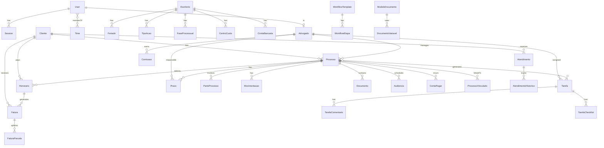
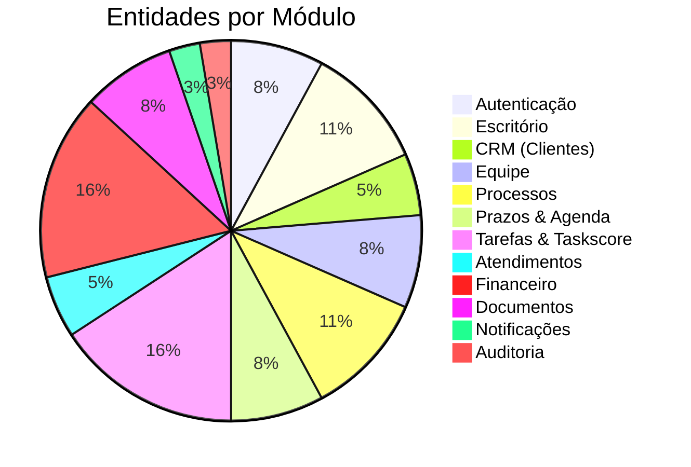

# 🗄️ Schema do Banco de Dados — Sistema Jurídico

> **Projeto:** Sistema de Gestão para Escritório de Advocacia
> **ORM:** Prisma + PostgreSQL
> **Versão:** 1.0
> **Data:** 2026-02-12

---

## 1. Visão Geral do Schema

| Módulo | Entidades | Descrição |
|--------|-----------|-----------|
| **Autenticação** | User, Session, Account | Usuários, sessões, RBAC |
| **Escritório** | Escritorio, Feriado, TipoAcao, FaseProcessual | Configurações base |
| **CRM** | Cliente, OrigemCliente | Clientes PF/PJ, prospecção |
| **Equipe** | Advogado, Time, TimeMembers | Equipe jurídica, times |
| **Processos** | Processo, ParteProcesso, Movimentacao, ProcessoVinculado | Processos judiciais |
| **Prazos** | Prazo, Audiencia, Compromisso | Prazos, audiências, agenda |
| **Tarefas** | Tarefa, TarefaComentario, TarefaChecklist, WorkflowTemplate, WorkflowEtapa | Taskscore, workflow |
| **Atendimentos** | Atendimento, AtendimentoHistorico | Pipeline de atendimento |
| **Financeiro** | Honorario, Fatura, FaturaParcela, ContaPagar, ContaBancaria, CentroCusto, Comissao | Gestão financeira |
| **Documentos** | ModeloDocumento, Documento, DocumentoVariavel | Editor, modelos, PDF |
| **Auditoria** | LogAuditoria | Rastreabilidade |

**Total: ~35 entidades**

---

## 2. Diagrama de Relacionamento (ERD)



---

## 3. Prisma Schema Completo

```prisma
// =============================================================
// prisma/schema.prisma
// Sistema Jurídico — Database Schema
// =============================================================

generator client {
  provider = "prisma-client-js"
}

datasource db {
  provider = "postgresql"
  url      = env("DATABASE_URL")
}

// =============================================================
// 🔐 AUTENTICAÇÃO & USUÁRIOS
// =============================================================

enum Role {
  ADMIN
  SOCIO
  ADVOGADO
  CONTROLADOR
  ASSISTENTE
  FINANCEIRO
  SECRETARIA
}

model User {
  id            String    @id @default(cuid())
  email         String    @unique
  name          String
  passwordHash  String
  role          Role      @default(ADVOGADO)
  avatarUrl     String?
  isActive      Boolean   @default(true)
  lastLoginAt   DateTime?
  createdAt     DateTime  @default(now())
  updatedAt     DateTime  @updatedAt

  // Relations
  sessions      Session[]
  advogado      Advogado?
  logs          LogAuditoria[]
  notifications Notificacao[]

  @@index([email])
  @@index([role])
  @@map("users")
}

model Session {
  id        String   @id @default(cuid())
  userId    String
  token     String   @unique
  expiresAt DateTime
  ipAddress String?
  userAgent String?
  createdAt DateTime @default(now())

  user User @relation(fields: [userId], references: [id], onDelete: Cascade)

  @@index([token])
  @@index([userId])
  @@map("sessions")
}

// =============================================================
// 🏢 ESCRITÓRIO & CONFIGURAÇÕES
// =============================================================

model Escritorio {
  id           String   @id @default(cuid())
  nome         String
  cnpj         String?  @unique
  endereco     String?
  cidade       String?
  estado       String?
  cep          String?
  telefone     String?
  email        String?
  logoUrl      String?
  createdAt    DateTime @default(now())
  updatedAt    DateTime @updatedAt

  // Relations
  feriados        Feriado[]
  tiposAcao       TipoAcao[]
  fasesProcessuais FaseProcessual[]
  centrosCusto    CentroCusto[]
  contasBancarias ContaBancaria[]

  @@map("escritorios")
}

model Feriado {
  id           String   @id @default(cuid())
  nome         String
  data         DateTime @db.Date
  recorrente   Boolean  @default(true)  // repete todo ano
  abrangencia  String   @default("NACIONAL") // NACIONAL, ESTADUAL, MUNICIPAL
  escritorioId String

  escritorio Escritorio @relation(fields: [escritorioId], references: [id])

  @@unique([data, escritorioId])
  @@index([data])
  @@map("feriados")
}

model TipoAcao {
  id           String   @id @default(cuid())
  nome         String   // Ex: Trabalhista, Cível, Criminal, Família
  grupo        String?  // Grupo de ação (para métricas de rentabilidade)
  descricao    String?
  ativo        Boolean  @default(true)
  escritorioId String

  escritorio Escritorio @relation(fields: [escritorioId], references: [id])
  processos  Processo[]

  @@unique([nome, escritorioId])
  @@map("tipos_acao")
}

model FaseProcessual {
  id           String  @id @default(cuid())
  nome         String  // Ex: Ajuizado, Em Andamento, Sentença...
  ordem        Int     // Sequência das fases
  cor          String? // Cor para Kanban
  ativo        Boolean @default(true)
  escritorioId String

  escritorio Escritorio @relation(fields: [escritorioId], references: [id])
  processos  Processo[]
  workflows  WorkflowTemplate[]

  @@unique([nome, escritorioId])
  @@index([ordem])
  @@map("fases_processuais")
}

// =============================================================
// 👥 CRM JURÍDICO (CLIENTES)
// =============================================================

enum TipoPessoa {
  FISICA
  JURIDICA
}

enum StatusCliente {
  PROSPECTO
  ATIVO
  INATIVO
  ARQUIVADO
}

model OrigemCliente {
  id   String @id @default(cuid())
  nome String @unique // Indicação, Internet, Parceiro, Redes Sociais...

  clientes Cliente[]

  @@map("origens_cliente")
}

model Cliente {
  id              String        @id @default(cuid())
  tipoPessoa      TipoPessoa    @default(FISICA)
  status          StatusCliente @default(PROSPECTO)
  
  // Dados PF
  nome            String
  cpf             String?       @unique
  rg              String?
  dataNascimento  DateTime?     @db.Date
  
  // Dados PJ
  razaoSocial     String?
  cnpj            String?       @unique
  nomeFantasia    String?
  
  // Contato
  email           String?
  telefone        String?
  celular         String?
  whatsapp        String?
  
  // Endereço
  endereco        String?
  numero          String?
  complemento     String?
  bairro          String?
  cidade          String?
  estado          String?
  cep             String?
  
  // Meta
  origemId        String?
  observacoes     String?
  inadimplente    Boolean       @default(false)
  createdAt       DateTime      @default(now())
  updatedAt       DateTime      @updatedAt

  // Relations
  origem          OrigemCliente? @relation(fields: [origemId], references: [id])
  processos       Processo[]
  atendimentos    Atendimento[]
  honorarios      Honorario[]
  faturas         Fatura[]
  partesProcesso  ParteProcesso[]

  @@index([nome])
  @@index([cpf])
  @@index([cnpj])
  @@index([status])
  @@index([inadimplente])
  @@map("clientes")
}

// =============================================================
// 👔 EQUIPE JURÍDICA
// =============================================================

model Advogado {
  id             String  @id @default(cuid())
  userId         String  @unique
  oab            String  // Ex: SP 123456
  seccional      String  // Ex: SP, RJ, MG
  especialidades String? // Áreas de atuação
  comissaoPercent Float   @default(0) // % de comissão sobre honorários
  ativo          Boolean @default(true)
  
  // Relations
  user           User    @relation(fields: [userId], references: [id])
  processos      Processo[]
  tarefas        Tarefa[]
  prazos         Prazo[]
  audiencias     Audiencia[]
  compromissos   Compromisso[]
  comissoes      Comissao[]
  atendimentos   Atendimento[]
  timeMembros    TimeMembro[]

  @@index([oab])
  @@map("advogados")
}

model Time {
  id        String   @id @default(cuid())
  nome      String   @unique
  descricao String?
  cor       String?  // Cor do time para visualização
  ativo     Boolean  @default(true)
  createdAt DateTime @default(now())

  membros TimeMembro[]

  @@map("times")
}

model TimeMembro {
  id         String @id @default(cuid())
  timeId     String
  advogadoId String
  lider      Boolean @default(false) // Líder do time

  time     Time     @relation(fields: [timeId], references: [id], onDelete: Cascade)
  advogado Advogado @relation(fields: [advogadoId], references: [id])

  @@unique([timeId, advogadoId])
  @@map("time_membros")
}

// =============================================================
// ⚖️ PROCESSOS
// =============================================================

enum TipoProcesso {
  JUDICIAL
  ADMINISTRATIVO
  CONSULTIVO
  SERVICO
  PROSPECCAO
}

enum StatusProcesso {
  PROSPECCAO
  CONSULTORIA
  AJUIZADO
  EM_ANDAMENTO
  AUDIENCIA_MARCADA
  SENTENCA
  RECURSO
  TRANSITO_JULGADO
  EXECUCAO
  ENCERRADO
  ARQUIVADO
}

enum ResultadoProcesso {
  GANHO
  PERDIDO
  ACORDO
  DESISTENCIA
  PENDENTE
}

model Processo {
  id               String           @id @default(cuid())
  numeroCnj        String?          @unique // NNNNNNN-DD.AAAA.J.TR.OOOO
  tipo             TipoProcesso     @default(JUDICIAL)
  status           StatusProcesso   @default(EM_ANDAMENTO)
  resultado        ResultadoProcesso @default(PENDENTE)
  
  // Detalhes jurídicos
  tipoAcaoId       String?
  faseProcessualId String?
  tribunal         String?
  vara             String?
  comarca          String?
  foro             String?
  objeto           String?          // Descrição/objeto do processo
  valorCausa       Decimal?         @db.Decimal(15, 2)
  
  // Contingenciamento
  valorContingencia Decimal?        @db.Decimal(15, 2)
  riscoContingencia String?         // PROVAVEL, POSSIVEL, REMOTO
  
  // Datas
  dataDistribuicao DateTime?        @db.Date
  dataEncerramento DateTime?        @db.Date
  
  // Responsável
  advogadoId       String
  clienteId        String
  
  // Meta
  observacoes      String?
  dataUltimaMovimentacao DateTime?
  createdAt        DateTime         @default(now())
  updatedAt        DateTime         @updatedAt

  // Relations
  tipoAcao      TipoAcao?       @relation(fields: [tipoAcaoId], references: [id])
  faseProcessual FaseProcessual? @relation(fields: [faseProcessualId], references: [id])
  advogado      Advogado         @relation(fields: [advogadoId], references: [id])
  cliente       Cliente          @relation(fields: [clienteId], references: [id])
  
  partes        ParteProcesso[]
  movimentacoes Movimentacao[]
  prazos        Prazo[]
  tarefas       Tarefa[]
  audiencias    Audiencia[]
  documentos    Documento[]
  honorarios    Honorario[]
  contasPagar   ContaPagar[]
  vinculosOrigem  ProcessoVinculado[] @relation("ProcessoOrigem")
  vinculosDestino ProcessoVinculado[] @relation("ProcessoDestino")

  @@index([numeroCnj])
  @@index([status])
  @@index([tipo])
  @@index([advogadoId])
  @@index([clienteId])
  @@index([faseProcessualId])
  @@index([tipoAcaoId])
  @@index([dataDistribuicao])
  @@index([dataUltimaMovimentacao])
  @@map("processos")
}

enum TipoParte {
  AUTOR
  REU
  TERCEIRO
  TESTEMUNHA
  PERITO
  ASSISTENTE_TECNICO
}

model ParteProcesso {
  id         String    @id @default(cuid())
  processoId String
  clienteId  String?   // Se for cliente cadastrado
  tipoParte  TipoParte
  
  // Dados da parte (quando não é cliente cadastrado)
  nome       String?
  cpfCnpj    String?
  advogado   String?   // Advogado da parte adversa (texto livre)
  
  processo   Processo  @relation(fields: [processoId], references: [id], onDelete: Cascade)
  cliente    Cliente?  @relation(fields: [clienteId], references: [id])

  @@index([processoId])
  @@map("partes_processo")
}

model Movimentacao {
  id         String   @id @default(cuid())
  processoId String
  data       DateTime @db.Date
  descricao  String
  tipo       String?  // Despacho, Decisão, Sentença, Petição...
  fonte      String?  // MANUAL, TRIBUNAL, IMPORTACAO
  createdAt  DateTime @default(now())

  processo Processo @relation(fields: [processoId], references: [id], onDelete: Cascade)

  @@index([processoId])
  @@index([data])
  @@map("movimentacoes")
}

enum TipoVinculo {
  CONEXAO
  CONTINENCIA
  RECURSO
  INCIDENTE
  RELACIONADO
}

model ProcessoVinculado {
  id              String      @id @default(cuid())
  processoOrigemId  String
  processoDestinoId String
  tipoVinculo     TipoVinculo

  processoOrigem  Processo @relation("ProcessoOrigem", fields: [processoOrigemId], references: [id])
  processoDestino Processo @relation("ProcessoDestino", fields: [processoDestinoId], references: [id])

  @@unique([processoOrigemId, processoDestinoId])
  @@map("processos_vinculados")
}

// =============================================================
// 📅 PRAZOS, AUDIÊNCIAS & AGENDA
// =============================================================

enum StatusPrazo {
  PENDENTE
  CONCLUIDO
  VENCIDO
}

enum TipoContagem {
  DIAS_UTEIS
  DIAS_CORRIDOS
}

model Prazo {
  id             String       @id @default(cuid())
  processoId     String
  advogadoId     String
  
  descricao      String
  dataFatal      DateTime     @db.Date
  dataCortesia   DateTime?    @db.Date  // dataFatal - 2 dias úteis
  tipoContagem   TipoContagem @default(DIAS_UTEIS)
  status         StatusPrazo  @default(PENDENTE)
  fatal          Boolean      @default(true) // Prazo fatal = não pode excluir
  
  concluidoEm    DateTime?
  concluidoPorId String?
  observacoes    String?
  createdAt      DateTime     @default(now())
  updatedAt      DateTime     @updatedAt

  processo Processo @relation(fields: [processoId], references: [id], onDelete: Cascade)
  advogado Advogado @relation(fields: [advogadoId], references: [id])

  @@index([processoId])
  @@index([advogadoId])
  @@index([dataFatal])
  @@index([status])
  @@index([status, dataFatal])
  @@map("prazos")
}

enum TipoAudiencia {
  CONCILIACAO
  INSTRUCAO
  JULGAMENTO
  UNA
  OUTRA
}

model Audiencia {
  id           String         @id @default(cuid())
  processoId   String
  advogadoId   String
  
  tipo         TipoAudiencia
  data         DateTime
  local        String?       // Vara / Tribunal
  sala         String?
  observacoes  String?
  realizada    Boolean        @default(false)
  resultadoResumo String?    // Resultado após audiência
  createdAt    DateTime       @default(now())
  updatedAt    DateTime       @updatedAt

  processo Processo @relation(fields: [processoId], references: [id], onDelete: Cascade)
  advogado Advogado @relation(fields: [advogadoId], references: [id])

  @@index([processoId])
  @@index([advogadoId])
  @@index([data])
  @@map("audiencias")
}

enum TipoCompromisso {
  REUNIAO
  CONSULTA
  VISITA
  DILIGENCIA
  OUTRO
}

model Compromisso {
  id          String          @id @default(cuid())
  advogadoId  String
  clienteId   String?
  
  tipo        TipoCompromisso
  titulo      String
  descricao   String?
  dataInicio  DateTime
  dataFim     DateTime?
  local       String?
  concluido   Boolean         @default(false)
  googleEventId String?       // ID do Google Calendar
  createdAt   DateTime        @default(now())
  updatedAt   DateTime        @updatedAt

  advogado Advogado @relation(fields: [advogadoId], references: [id])

  @@index([advogadoId])
  @@index([dataInicio])
  @@map("compromissos")
}

// =============================================================
// ✅ TAREFAS & TASKSCORE
// =============================================================

enum PrioridadeTarefa {
  URGENTE
  ALTA
  NORMAL
  BAIXA
}

enum StatusTarefa {
  A_FAZER
  EM_ANDAMENTO
  REVISAO
  CONCLUIDA
  CANCELADA
}

enum CategoriaEntrega {
  D_MENOS_1  // Entregue antes do prazo
  D_0        // Entregue no dia
  FORA_PRAZO // Entregue após o prazo
}

model Tarefa {
  id            String           @id @default(cuid())
  titulo        String
  descricao     String?
  prioridade    PrioridadeTarefa @default(NORMAL)
  status        StatusTarefa     @default(A_FAZER)
  
  // Taskscore
  pontos        Int              @default(1) // Peso da tarefa
  categoriaEntrega CategoriaEntrega?
  
  // Datas
  dataLimite    DateTime?        @db.Date
  concluidaEm   DateTime?
  
  // Vinculação
  processoId    String?
  advogadoId    String           // Responsável
  criadoPorId   String           // Quem criou
  
  // Timesheet
  horasEstimadas Float?
  horasGastas    Float?          @default(0)
  
  // Workflow
  workflowTemplateId String?
  ordemWorkflow      Int?
  
  createdAt     DateTime         @default(now())
  updatedAt     DateTime         @updatedAt

  processo      Processo?        @relation(fields: [processoId], references: [id])
  advogado      Advogado         @relation(fields: [advogadoId], references: [id])
  
  comentarios   TarefaComentario[]
  checklist     TarefaChecklist[]
  registrosHora TarefaRegistroHora[]

  @@index([advogadoId])
  @@index([processoId])
  @@index([status])
  @@index([prioridade])
  @@index([dataLimite])
  @@index([status, advogadoId])
  @@map("tarefas")
}

model TarefaComentario {
  id        String   @id @default(cuid())
  tarefaId  String
  userId    String
  conteudo  String
  createdAt DateTime @default(now())

  tarefa Tarefa @relation(fields: [tarefaId], references: [id], onDelete: Cascade)

  @@index([tarefaId])
  @@map("tarefa_comentarios")
}

model TarefaChecklist {
  id        String  @id @default(cuid())
  tarefaId  String
  texto     String
  concluido Boolean @default(false)
  ordem     Int     @default(0)

  tarefa Tarefa @relation(fields: [tarefaId], references: [id], onDelete: Cascade)

  @@index([tarefaId])
  @@map("tarefa_checklists")
}

model TarefaRegistroHora {
  id         String   @id @default(cuid())
  tarefaId   String
  userId     String
  horas      Float
  descricao  String?
  data       DateTime @db.Date
  createdAt  DateTime @default(now())

  tarefa Tarefa @relation(fields: [tarefaId], references: [id], onDelete: Cascade)

  @@index([tarefaId])
  @@index([userId])
  @@index([data])
  @@map("tarefa_registros_hora")
}

// --- Workflow Automático ---

model WorkflowTemplate {
  id              String @id @default(cuid())
  nome            String
  descricao       String?
  faseProcessualId String? // Dispara quando processo entra nesta fase
  ativo           Boolean @default(true)

  faseProcessual FaseProcessual? @relation(fields: [faseProcessualId], references: [id])
  etapas         WorkflowEtapa[]

  @@map("workflow_templates")
}

model WorkflowEtapa {
  id                String @id @default(cuid())
  workflowTemplateId String
  
  titulo      String
  descricao   String?
  pontos      Int     @default(1)
  ordem       Int     // Sequência de execução
  diasPrazo   Int     @default(3) // Prazo em dias após ativação
  
  workflowTemplate WorkflowTemplate @relation(fields: [workflowTemplateId], references: [id], onDelete: Cascade)

  @@index([workflowTemplateId])
  @@index([ordem])
  @@map("workflow_etapas")
}

// =============================================================
// 🤝 ATENDIMENTOS
// =============================================================

enum StatusAtendimento {
  LEAD
  QUALIFICACAO
  PROPOSTA
  FECHAMENTO
  CONVERTIDO
  PERDIDO
}

enum CanalAtendimento {
  PRESENCIAL
  TELEFONE
  EMAIL
  WHATSAPP
  SITE
  INDICACAO
}

enum ViabilidadeAtendimento {
  VIAVEL
  INVIAVEL
  EM_ANALISE
}

model Atendimento {
  id           String               @id @default(cuid())
  clienteId    String
  advogadoId   String
  
  status       StatusAtendimento    @default(LEAD)
  canal        CanalAtendimento     @default(PRESENCIAL)
  viabilidade  ViabilidadeAtendimento @default(EM_ANALISE)
  
  assunto      String
  resumo       String?
  dataRetorno  DateTime?            // Follow-up agendado
  processoId   String?              // Se convertido em processo
  
  createdAt    DateTime             @default(now())
  updatedAt    DateTime             @updatedAt

  cliente    Cliente    @relation(fields: [clienteId], references: [id])
  advogado   Advogado   @relation(fields: [advogadoId], references: [id])
  historicos AtendimentoHistorico[]

  @@index([clienteId])
  @@index([advogadoId])
  @@index([status])
  @@index([createdAt])
  @@map("atendimentos")
}

model AtendimentoHistorico {
  id             String          @id @default(cuid())
  atendimentoId  String
  canal          CanalAtendimento
  descricao      String
  userId         String
  createdAt      DateTime        @default(now())

  atendimento Atendimento @relation(fields: [atendimentoId], references: [id], onDelete: Cascade)

  @@index([atendimentoId])
  @@map("atendimento_historicos")
}

// =============================================================
// 💰 FINANCEIRO
// =============================================================

enum TipoHonorario {
  FIXO
  EXITO
  POR_HORA
  MISTO
}

enum StatusHonorario {
  ATIVO
  SUSPENSO
  ENCERRADO
}

model Honorario {
  id           String          @id @default(cuid())
  processoId   String
  clienteId    String
  
  tipo         TipoHonorario
  status       StatusHonorario @default(ATIVO)
  valorTotal   Decimal         @db.Decimal(15, 2)
  percentualExito Decimal?     @db.Decimal(5, 2) // % de êxito
  valorHora    Decimal?        @db.Decimal(10, 2)
  descricao    String?
  
  dataContrato DateTime        @db.Date
  createdAt    DateTime        @default(now())
  updatedAt    DateTime        @updatedAt

  processo Processo @relation(fields: [processoId], references: [id])
  cliente  Cliente  @relation(fields: [clienteId], references: [id])
  faturas  Fatura[]

  @@index([processoId])
  @@index([clienteId])
  @@map("honorarios")
}

enum StatusFatura {
  PENDENTE
  PAGA
  ATRASADA
  CANCELADA
}

model Fatura {
  id            String       @id @default(cuid())
  numero        String       @unique // Número sequencial
  honorarioId   String?
  clienteId     String
  
  status        StatusFatura @default(PENDENTE)
  valorTotal    Decimal      @db.Decimal(15, 2)
  dataEmissao   DateTime     @db.Date
  dataVencimento DateTime    @db.Date
  dataPagamento DateTime?    @db.Date
  
  descricao     String?
  recorrente    Boolean      @default(false)
  
  // Gateway de pagamento
  gatewayId     String?      // ID externo no gateway
  boletoUrl     String?
  pixCode       String?
  
  centroCustoId String?
  createdAt     DateTime     @default(now())
  updatedAt     DateTime     @updatedAt

  honorario   Honorario?   @relation(fields: [honorarioId], references: [id])
  cliente     Cliente      @relation(fields: [clienteId], references: [id])
  centroCusto CentroCusto? @relation(fields: [centroCustoId], references: [id])
  parcelas    FaturaParcela[]

  @@index([clienteId])
  @@index([honorarioId])
  @@index([status])
  @@index([dataVencimento])
  @@index([status, dataVencimento])
  @@map("faturas")
}

model FaturaParcela {
  id            String       @id @default(cuid())
  faturaId      String
  numeroParcela Int
  valor         Decimal      @db.Decimal(15, 2)
  dataVencimento DateTime    @db.Date
  dataPagamento DateTime?    @db.Date
  status        StatusFatura @default(PENDENTE)

  fatura Fatura @relation(fields: [faturaId], references: [id], onDelete: Cascade)

  @@index([faturaId])
  @@index([dataVencimento])
  @@map("fatura_parcelas")
}

enum TipoConta {
  CUSTO_PROCESSUAL
  DESPESA_ESCRITORIO
  FORNECEDOR
  IMPOSTO
  OUTRO
}

model ContaPagar {
  id             String      @id @default(cuid())
  descricao      String
  tipo           TipoConta   @default(DESPESA_ESCRITORIO)
  valor          Decimal     @db.Decimal(15, 2)
  dataVencimento DateTime    @db.Date
  dataPagamento  DateTime?   @db.Date
  pago           Boolean     @default(false)
  
  processoId     String?     // Vinculação opcional ao processo
  centroCustoId  String?
  contaBancariaId String?
  
  createdAt      DateTime    @default(now())
  updatedAt      DateTime    @updatedAt

  processo      Processo?      @relation(fields: [processoId], references: [id])
  centroCusto   CentroCusto?   @relation(fields: [centroCustoId], references: [id])
  contaBancaria ContaBancaria? @relation(fields: [contaBancariaId], references: [id])

  @@index([processoId])
  @@index([dataVencimento])
  @@index([pago])
  @@map("contas_pagar")
}

model ContaBancaria {
  id           String @id @default(cuid())
  nome         String // Ex: Conta Corrente BB, Nubank PJ
  banco        String?
  agencia      String?
  conta        String?
  tipo         String @default("CORRENTE") // CORRENTE, POUPANCA, INVESTIMENTO
  saldoInicial Decimal @default(0) @db.Decimal(15, 2)
  ativo        Boolean @default(true)
  escritorioId String

  escritorio Escritorio   @relation(fields: [escritorioId], references: [id])
  contasPagar ContaPagar[]

  @@map("contas_bancarias")
}

model CentroCusto {
  id           String @id @default(cuid())
  nome         String // Ex: Trabalhista, Cível, Administrativo
  descricao    String?
  ativo        Boolean @default(true)
  escritorioId String

  escritorio  Escritorio  @relation(fields: [escritorioId], references: [id])
  faturas     Fatura[]
  contasPagar ContaPagar[]

  @@unique([nome, escritorioId])
  @@map("centros_custo")
}

model Comissao {
  id          String  @id @default(cuid())
  advogadoId  String
  faturaId    String?
  
  valor       Decimal @db.Decimal(15, 2)
  percentual  Decimal @db.Decimal(5, 2)
  referencia  String? // Descrição do que gerou a comissão
  pago        Boolean @default(false)
  dataPagamento DateTime? @db.Date
  createdAt   DateTime @default(now())

  advogado Advogado @relation(fields: [advogadoId], references: [id])

  @@index([advogadoId])
  @@index([pago])
  @@map("comissoes")
}

// =============================================================
// 📝 DOCUMENTOS & MODELOS
// =============================================================

model ModeloDocumento {
  id        String @id @default(cuid())
  nome      String // Ex: Petição Inicial Trabalhista
  categoria String // Ex: Petição, Contrato, Procuração, Laudo
  conteudo  String @db.Text // HTML/TipTap JSON
  ativo     Boolean @default(true)
  createdAt DateTime @default(now())
  updatedAt DateTime @updatedAt

  variaveis DocumentoVariavel[]

  @@index([categoria])
  @@map("modelo_documentos")
}

model DocumentoVariavel {
  id        String @id @default(cuid())
  modeloId  String
  chave     String // Ex: {{NOME_CLIENTE}}, {{NUMERO_CNJ}}
  descricao String // Ex: Nome completo do cliente
  origem    String // Ex: cliente.nome, processo.numeroCnj

  modelo ModeloDocumento @relation(fields: [modeloId], references: [id], onDelete: Cascade)

  @@unique([modeloId, chave])
  @@map("documento_variaveis")
}

model Documento {
  id         String  @id @default(cuid())
  processoId String
  
  titulo     String
  categoria  String  // Petição, Contrato, Procuração, Laudo, Outro
  conteudo   String? @db.Text // HTML/TipTap JSON (se editado online)
  arquivoUrl String? // URL do arquivo uploaded
  arquivoNome String?
  arquivoTamanho Int? // Em bytes
  mimeType   String?
  versao     Int     @default(1)
  
  createdAt  DateTime @default(now())
  updatedAt  DateTime @updatedAt

  processo Processo @relation(fields: [processoId], references: [id], onDelete: Cascade)

  @@index([processoId])
  @@index([categoria])
  @@map("documentos")
}

// =============================================================
// 🔔 NOTIFICAÇÕES
// =============================================================

enum TipoNotificacao {
  PRAZO_VENCENDO
  PRAZO_VENCIDO
  TAREFA_ATRIBUIDA
  TAREFA_REATRIBUIDA
  FATURA_VENCENDO
  FATURA_VENCIDA
  AUDIENCIA_PROXIMA
  ANIVERSARIANTE
  PROCESSO_MOVIMENTACAO
  SISTEMA
}

model Notificacao {
  id        String           @id @default(cuid())
  userId    String
  tipo      TipoNotificacao
  titulo    String
  mensagem  String
  lida      Boolean          @default(false)
  linkUrl   String?          // Link para o recurso relacionado
  createdAt DateTime         @default(now())

  user User @relation(fields: [userId], references: [id], onDelete: Cascade)

  @@index([userId])
  @@index([userId, lida])
  @@index([createdAt])
  @@map("notificacoes")
}

// =============================================================
// 📋 LOG DE AUDITORIA
// =============================================================

model LogAuditoria {
  id        String   @id @default(cuid())
  userId    String
  acao      String   // CREATE, UPDATE, DELETE
  entidade  String   // Nome da tabela/modelo
  entidadeId String  // ID do registro
  dadosAntes Json?   // Snapshot antes da alteração
  dadosDepois Json?  // Snapshot após a alteração
  ipAddress String?
  createdAt DateTime @default(now())

  user User @relation(fields: [userId], references: [id])

  @@index([userId])
  @@index([entidade, entidadeId])
  @@index([createdAt])
  @@map("logs_auditoria")
}
```

---

## 4. Estratégia de Índices

### Índices Compostos (Performance)

| Tabela | Índice | Uso |
|--------|--------|-----|
| `prazos` | `(status, dataFatal)` | Prazos pendentes próximos de vencer |
| `tarefas` | `(status, advogadoId)` | Tarefas do advogado por status |
| `faturas` | `(status, dataVencimento)` | Faturas atrasadas |
| `notificacoes` | `(userId, lida)` | Notificações não lidas do usuário |
| `processos` | `(status, advogadoId)` | Processos ativos do advogado |

### Índices de Busca Textual

| Tabela | Campo | Tipo |
|--------|-------|------|
| `clientes` | `nome` | B-tree (prefix search via `LIKE 'termo%'`) |
| `processos` | `numeroCnj` | B-tree (exact + prefix) |
| `clientes` | `cpf`, `cnpj` | B-tree (exact match) |

> **Nota:** Para busca full-text futura, considerar pg_trgm ou ts_vector no PostgreSQL.

---

## 5. Dados de Seed (Inicialização)

O seed irá popular dados essenciais para o funcionamento do sistema:

```typescript
// prisma/seed.ts — Resumo do que será criado

const seedData = {
  // Escritório padrão
  escritorio: {
    nome: "Escritório Demo",
    cnpj: "00.000.000/0001-00"
  },

  // Feriados nacionais 2026
  feriados: [
    { nome: "Confraternização Universal", data: "2026-01-01" },
    { nome: "Carnaval", data: "2026-02-16" },
    { nome: "Carnaval", data: "2026-02-17" },
    { nome: "Sexta-feira Santa", data: "2026-04-03" },
    { nome: "Tiradentes", data: "2026-04-21" },
    { nome: "Dia do Trabalho", data: "2026-05-01" },
    { nome: "Corpus Christi", data: "2026-06-04" },
    { nome: "Independência do Brasil", data: "2026-09-07" },
    { nome: "Nossa Sra. Aparecida", data: "2026-10-12" },
    { nome: "Finados", data: "2026-11-02" },
    { nome: "Proclamação da República", data: "2026-11-15" },
    { nome: "Natal", data: "2026-12-25" }
  ],

  // Tipos de ação padrão
  tiposAcao: [
    { nome: "Trabalhista", grupo: "Trabalhista" },
    { nome: "Cível", grupo: "Cível" },
    { nome: "Consumidor", grupo: "Cível" },
    { nome: "Família e Sucessões", grupo: "Família" },
    { nome: "Previdenciário", grupo: "Previdenciário" },
    { nome: "Tributário", grupo: "Tributário" },
    { nome: "Criminal", grupo: "Criminal" },
    { nome: "Empresarial", grupo: "Empresarial" },
    { nome: "Administrativo", grupo: "Administrativo" },
    { nome: "Imobiliário", grupo: "Cível" }
  ],

  // Fases processuais padrão
  fasesProcessuais: [
    { nome: "Distribuído", ordem: 1, cor: "#3B82F6" },
    { nome: "Citação", ordem: 2, cor: "#6366F1" },
    { nome: "Contestação", ordem: 3, cor: "#8B5CF6" },
    { nome: "Instrução", ordem: 4, cor: "#A855F7" },
    { nome: "Audiência", ordem: 5, cor: "#EC4899" },
    { nome: "Sentença", ordem: 6, cor: "#F59E0B" },
    { nome: "Recurso", ordem: 7, cor: "#EF4444" },
    { nome: "Trânsito em Julgado", ordem: 8, cor: "#10B981" },
    { nome: "Execução", ordem: 9, cor: "#14B8A6" },
    { nome: "Encerrado", ordem: 10, cor: "#6B7280" }
  ],

  // Origens de cliente
  origensCliente: [
    "Indicação",
    "Internet / Google",
    "Redes Sociais",
    "Parceiro / Convênio",
    "OAB",
    "Propaganda",
    "Retorno de Cliente",
    "Outro"
  ],

  // Centros de custo
  centrosCusto: [
    "Trabalhista",
    "Cível",
    "Criminal",
    "Administrativo",
    "Escritório Geral"
  ],

  // Usuário admin
  adminUser: {
    name: "Administrador",
    email: "admin@escritorio.com",
    role: "ADMIN",
    password: "admin123" // Hash no seed
  }
}
```

---

## 6. Regras de Negócio no Schema

| Regra | Implementação na Camada |
|-------|------------------------|
| RN-02: CNJ único | `@unique` no campo `numeroCnj` |
| RN-05: Prazo fatal não excluir | Campo `fatal: Boolean` + validação no Server Action |
| RN-06: Dias úteis | `prazo-utils.ts` + tabela `Feriado` |
| RN-08: Prazo vencido alerta | Cron job + query `status=PENDENTE AND dataFatal < hoje` |
| RN-11: Intimação → advogado | `advogadoId` no `Prazo`, auto-atribuído via `Processo.advogadoId` |
| RN-12: Taskscore | Campo `pontos` em `Tarefa`, soma agregada por advogado |
| RN-13: Workflow automático | `WorkflowTemplate` vinculado a `FaseProcessual` |
| RN-16: Categorização D-1/D-0 | Enum `CategoriaEntrega`, calculada ao concluir tarefa |
| RN-19: Inadimplência | Query `faturas.status=ATRASADA AND vencimento < 30d` → `cliente.inadimplente=true` |
| RN-20: Centro de custo | `centroCustoId` obrigatório em `Fatura` e `ContaPagar` |
| RN-26: Auditoria | Tabela `LogAuditoria` com middleware Prisma |
| RN-28: LGPD | Campos de consentimento + soft-delete nas entidades de pessoa |

---

## 7. Contagem de Entidades por Módulo



| Módulo | Entidades | Total |
|--------|-----------|-------|
| Autenticação | User, Session, (Role enum) | 2 |
| Escritório | Escritorio, Feriado, TipoAcao, FaseProcessual | 4 |
| CRM | Cliente, OrigemCliente | 2 |
| Equipe | Advogado, Time, TimeMembro | 3 |
| Processos | Processo, ParteProcesso, Movimentacao, ProcessoVinculado | 4 |
| Prazos/Agenda | Prazo, Audiencia, Compromisso | 3 |
| Tarefas | Tarefa, TarefaComentario, TarefaChecklist, TarefaRegistroHora, WorkflowTemplate, WorkflowEtapa | 6 |
| Atendimentos | Atendimento, AtendimentoHistorico | 2 |
| Financeiro | Honorario, Fatura, FaturaParcela, ContaPagar, ContaBancaria, CentroCusto, Comissao | 7 |
| Documentos | ModeloDocumento, DocumentoVariavel, Documento | 3 |
| Notificações | Notificacao | 1 |
| Auditoria | LogAuditoria | 1 |
| **TOTAL** | | **38 entidades** |

---

## 8. Próximos Passos

| Fase | Entrega | Status |
|------|---------|--------|
| ~~PARTE 1~~ | ~~Escopo e Requisitos~~ | ✅ |
| ~~PARTE 2~~ | ~~Arquitetura Técnica~~ | ✅ |
| ~~**PARTE 3**~~ | ~~**Schema do Banco de Dados**~~ | ✅ Este documento |
| **PARTE 4** | Design System + Wireframes | ⏳ Próximo |
| **PARTE 5** | Implementação por módulos | ⏳ |

---

> **Documento gerado por:** `@orchestrator` + `@database-architect`
> **Status:** 📝 Aguardando revisão e aprovação
